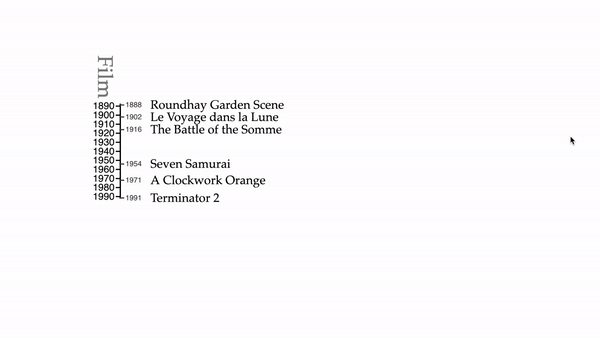

# Media Timeline

This is a utility for creating interactive timelines like the one below:

[](https://web.media.mit.edu/~holbrow/timelines/)

**[Try A Demo](https://web.media.mit.edu/~holbrow/timelines/)**

These timelines use a **contextual zoom** feature, which continuously adjusts
between a high level overview of events on a time line and detailed granularity.

## Code Example

See https://github.com/mitmedialab/opera-timeline. Studying this example
is currently the easiest way to learn how to implement your own.

## How It Works

**IMPORTANT:** `npm install d3-media-timeline` is **not** the easiest way to
get up and running.

The best way to use this package is as part of a [`rollup.js`](https://rollupjs.org) build procedure.

Configuring a repo takes several steps. Once configured, it is very easy to add multimedia content to the timeline. Fortunately, you can start from an example that does all the configuration for you. I

A conventional setup involves:

- [`rollup.js`](https://rollupjs.org)
- [@rollup/plugin-yaml npm package](https://github.com/rollup/plugins/tree/master/packages/yaml), which is configured using the `transform` feature in the rollup configuration `{ plugins: [ yaml({ transform: populateHtmlFields })] }`
- [babel.js](https://babeljs.io/)

Several frontend packages are used (but you do not need to understand these):
- [d3.js v5](https://d3js.org/) (A small subset of d3 functionality is used, and `imported` by this module)
- [Kefir.js](https://kefirjs.github.io/kefir/)
- [eventemitter3](https://www.npmjs.com/package/eventemitter3)

A simple configuration example is below. Note that this example also depends on a rollup.js configuration. For an example of a rollup config, see the example repository.

```JavaScript
import { MasterTimeline, d3, createTimelineEvents } from 'd3-media-timeline';

// Load content from a yaml file.
import soundRecording from './content/sound-recording.yaml';
const soundContent = createTimelineEvents(soundRecording);

// Setup a MasterTimeline, which is the parent object for Timeline Objects
const parentSelection = d3.select('div#media-timeline');
window.master = new MasterTimeline(parentSelection);

// Add sub timelines
master.addTimeline('Sound', soundContent, { start: new Date(1877, 0, 1), end: new Date(1990, 0, 1) });

// Update the master, to ensure that the initial render is correct
master.update();
```
